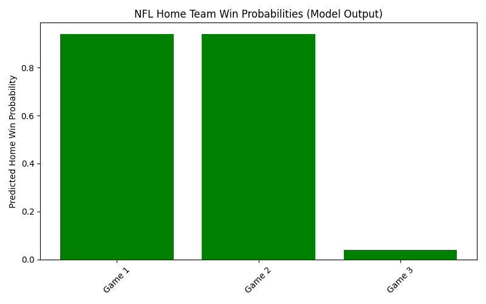

# NFL Game Outcome Predictor

This project uses simulated NFL game data to train a Random Forest machine learning model that predicts the probability of a home team win. Results are visualized in a bar chart that shows predicted home win probabilities for each game, colored by the actual outcome.

### Features
- Python + scikit-learn model
- Sample (replaceable) NFL stats data
- Probabilities and results visualized in Matplotlib

### Run it
- Place your own NFL games data into a DataFrame for more meaningful predictions.
- Run `nfl_predictor.py` to retrain and generate the chart (`nfl_home_win_probabilities.png`).

### Example Chart

